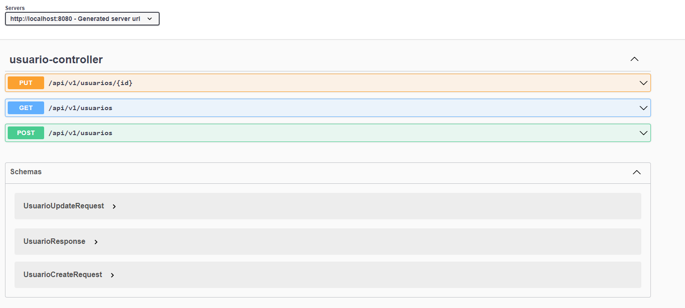

<div align="center">

# POC - Clean Architecture


</div> 


## Fundamentos teóricos

> Esta aplicação tem o objetivo de manter usuarios na base de dados utilizando o padrão de arquitetura limpa. A aplicação disponibiliza 3 end points.
	
	- Cadastrar Usuário
	- Lista todos
	- Atualizar Usuário

## Tecnologias
- 	Spring boot 2.6.7
- 	java 11
-	 H2
-	 Swagger
-	Lombok
-	Junit 5
-	Jacoco

## Execução

  ** Executar comandos no maven
   
   - ``` mvn clean package spring-boot:repackage```
   - ```java -jar target/clean-arch-spring-0.0.1-SNAPSHOT.jar```
 
  
## Acesso Ferramentas
- Swagger: http://localhost:8080/openapi/swagger-ui/index.html 
 
 -   
    )
    
